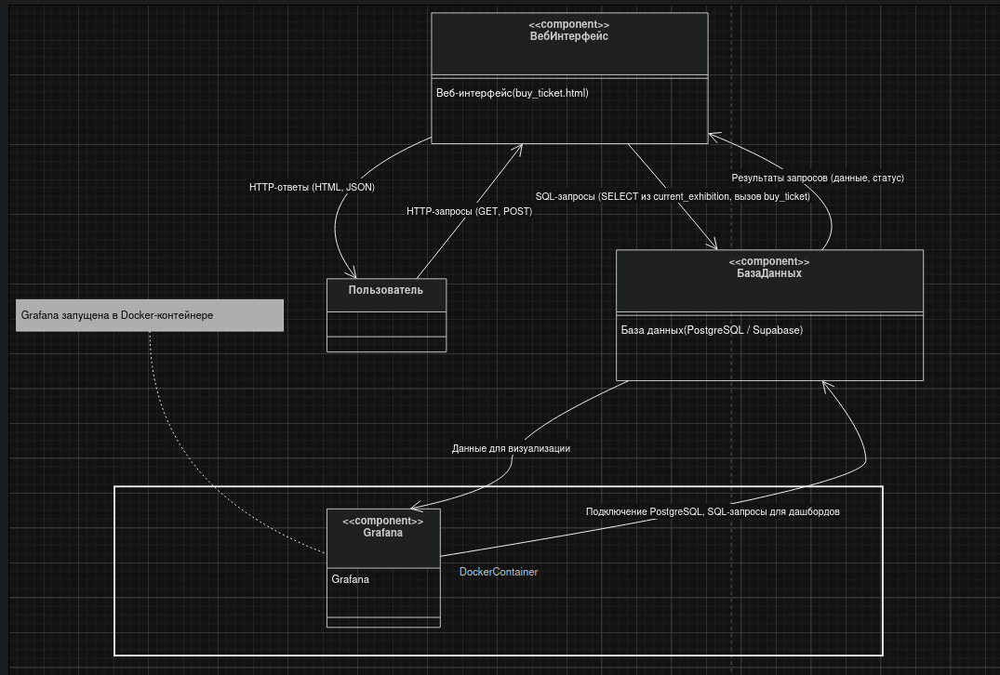
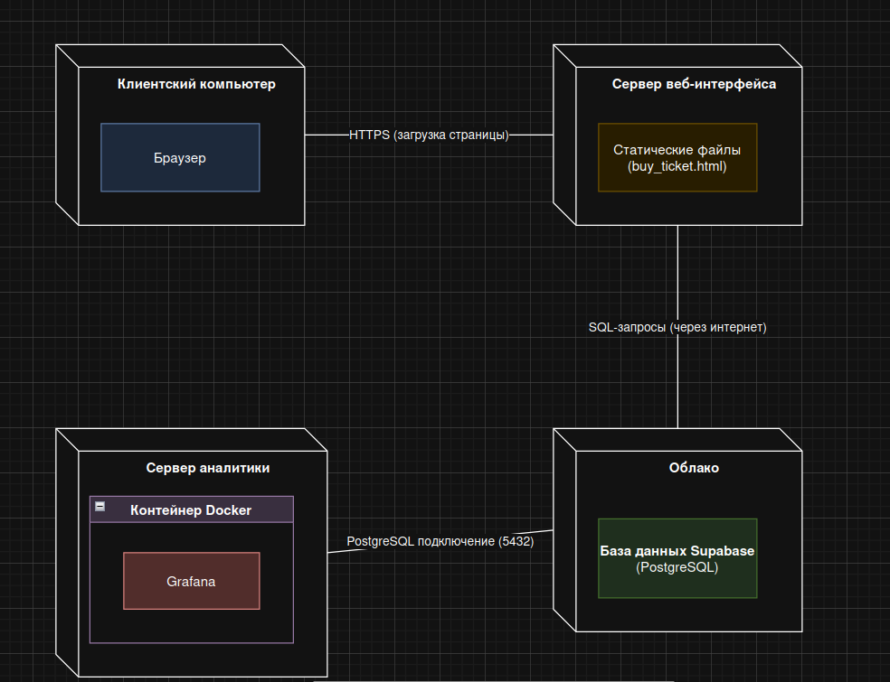
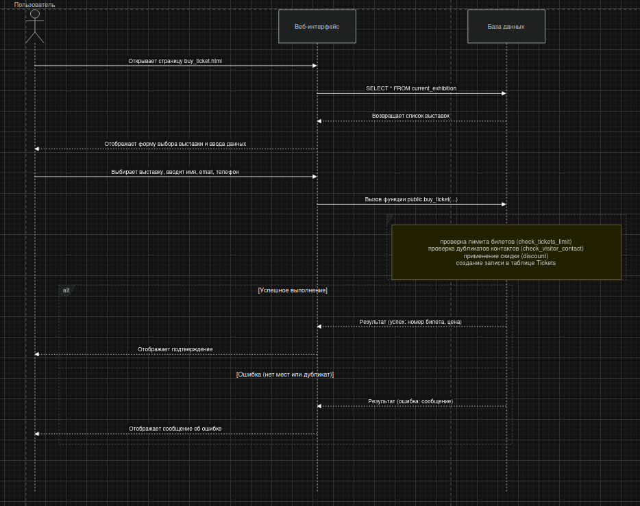
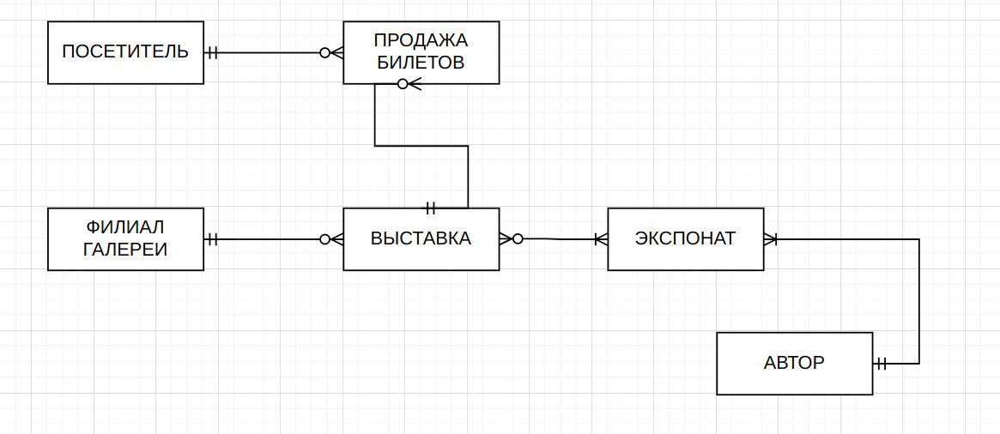
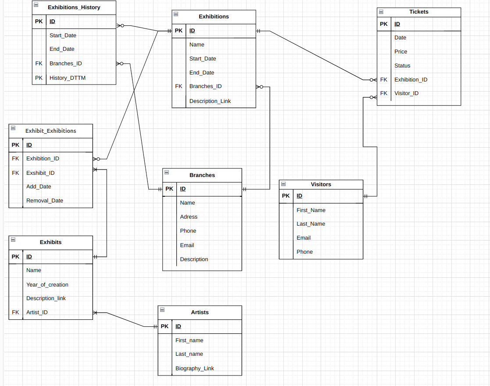

#  База данных арт-галереи

Проект представляет собой полноценную базу данных для управления арт-галереей, включающую учёт посетителей, билетов, выставок, экспонатов и филиалов. Реализованы аналитические запросы, триггеры для поддержки бизнес-логики, представления для упрощения работы, а также веб-интерфейс для покупки билетов и дашборд в Grafana для визуализации ключевых метрик.


---

## Оглавление

- [Архитектура проекта](#архитектура-проекта)
  - [Компоненты системы](#компоненты-системы)
  - [Диаграммы архитектуры](#диаграммы-архитектуры)
- [Структура репозитория](#структура-репозитория)
- [Структура базы данных](#структура-базы-данных)
- [Скрипты для аналитики и управления](#скрипты-для-аналитики-и-управления)
- [Оптимизация производительности (Индексы)](#оптимизация-производительности-индексы)
- [Автоматизация (Триггеры)](#автоматизация-триггеры)
- [Упрощение работы (Представления и Процедуры)](#упрощение-работы-представления-и-процедуры)
  - [Представления (Views)](#представления-views)
  - [Процедура (Procedure)](#процедура-procedure)
- [Вспомогательные функции](#вспомогательные-функции)
- [Модели базы данных](#модели-базы-данных)
  - [Концептуальная модель](#концептуальная-модель)
  - [Логическая модель](#логическая-модель)
  - [Физическая модель](#физическая-модель)
- [Дашборд](#дашборд)
  - [Используемые технологии](#используемые-технологии)
- [Веб-интерфейс для покупки билетов](#веб-интерфейс-для-покупки-билетов)
- [Заключение](#заключение)

## Архитектура проекта

### Компоненты системы
- **PostgreSQL - Supabase** – основное хранилище данных, содержит все таблицы, триггеры, функции и процедуры.
- **Веб-интерфейс (HTML/JS)** – клиентская часть для покупки билетов, взаимодействует с БД через вызовы функций.
- **Grafana** – инструмент визуализации, подключается к БД для построения аналитических дашбордов.
- **Docker** – контейнеризация окружения, обеспечивает изолированный запуск Grafana и (при необходимости) базы данных.

### Диаграммы архитектуры
В папке `docs/architecture/` размещены диаграммы, иллюстрирующие устройство системы:

- **Диаграмма компонентов**  – показывает компоненты и их взаимодействие.
- **Диаграмма развертывания**  – отображает физическое размещение серверов и клиентов.
- **Диаграмма последовательности покупки билета**  – детализирует процесс оформления билета: загрузка списка выставок, ввод данных, вызов функции `buy_ticket`, проверка ограничений, результат.

Все диаграммы выполнены в формате PNG и draw.io .

## Cтруктура репозитория
```

├── buy_ticket.html
├── Dashboard
│   └── main_dashboard.json
├── docker-compose.yml
├── docs
│   ├── architecture
│   │   ├── component.drawio
│   │   ├── component.png
│   │   ├── deployment.drawio
│   │   ├── deployment.png
│   │   ├── sequence_buy_ticket.drawio
│   │   └── sequence_buy_ticket.png
│   └── models_bd
│       ├── conceptual_model.png
│       ├── logical_model.png
│       └── phys_model.ods
├── README.md
├── scripts
│   ├── analitic_scripts
│   │   ├── avg_tickets.sql
│   │   ├── conflicts_exshibits.sql
│   │   ├── contemporary_art.sql
│   │   ├── exhibitions_on_branch.sql
│   │   ├── last_changes.sql
│   │   ├── popular_artists.sql
│   │   ├── rank_exhibitions.sql
│   │   ├── revenue_exhibition.sql
│   │   ├── top3_visitors.sql
│   │   └── unusual_exhibits.sql
│   ├── create_scripts
│   │   ├── add_fk_history.sql
│   │   ├── add_fk.sql
│   │   ├── create_artists.sql
│   │   ├── create_branches.sql
│   │   ├── create_exhibit_exhibitions.sql
│   │   ├── create_Exhibitions_History.sql
│   │   ├── create_exhibitions.sql
│   │   ├── create_exhibits.sql
│   │   ├── create_shema_Art_Galery.sql
│   │   ├── create_tickets.sql
│   │   └── create_visitors.sql
│   ├── functions
│   │   ├── func_is_exhibition_available.sql
│   │   ├── func_is_exhibit_on_exhibition.sql
│   │   ├── procedure_update_ticket_status.sql
│   │   └── public_buy_tickets.sql
│   ├── triggers
│   │   ├── check_tickets_limit.sql
│   │   ├── check_visitor_contact.sql
│   │   └── discount.sql
│   └── views
│       ├── current_exhibitions.sql
│       └── visitors_with_tickets_activity.sql
└── test_system.mp4
```

##  Структура базы данных

Логическая схема базы данных состоит из 8 основных таблиц:

| Таблица | Описание |
| :--- | :--- |
| **Visitors** | Хранит персональные данные посетителей галереи. |
| **Tickets** | Учитывает продажи билетов, связывая посетителей с конкретными выставками. |
| **Branches** | Содержит информацию о филиалах (отделениях) галереи. |
| **Exhibits** | Содержит данные об экспонатах (название, автор, год создания и т.д.). |
| **Exhibitions** | Управляет деталями выставок (название, даты проведения, вместимость, филиал). |
| **Exhibit_Exhibitions** | Связующая таблица для реализации связи "многие ко многим" между экспонатами и выставками. |
| **Exhibition_History** | Отслеживает изменения и историю правок в данных о выставках. |
| **Artists** | Хранит информацию о художниках — авторах экспонатов. |

---

##  Скрипты для аналитики и управления

Для решения прикладных задач были разработаны следующие скрипты:

1.  **`avg_tickets`** : Рассчитывает отклонение цены билета от средней цены по выставке.
2.  **`conflicts_exhibits`** : Проверяет, что один и тот же экспонат не участвует в двух пересекающихся по времени выставках.
3.  **`contemporary-art`** : Находит выставки современного искусства.
4.  **`exhibitions_on_branches`** : Сопоставляет каждому филиалу выставку, которая в нем проводится, либо `NULL`, если выставок в данный момент нет.
5.  **`last_changes`** : Упорядочивает историю изменений выставок, показывая последние правки первыми.
6.  **`popular_artists`** : Находит популярных художников (имеющих в коллекции более двух экспонатов).
7.  **`rank_exhibitions`** : Ранжирует выставки по количеству проданных билетов.
8.  **`revenue-exhibitions`** : Рассчитывает выручку каждой выставки.
9.  **`top3_visitors`** : Находит трех самых активных посетителей (купивших больше всего билетов).
10. **`unusual_exhibits`** : Ищет экспонаты, которые никогда не участвовали ни в одной выставке.

---

##  Оптимизация производительности (Индексы)

Для ускорения поиска и фильтрации данных созданы два ключевых индекса:

1.  **Поиск экспонатов:** Индекс для таблицы `Exhibits` по названию и автору, ускоряющий поиск конкретных произведений.
2.  **Поиск билетов:** Индекс для таблицы `Tickets` по владельцу и статусу, оптимизирующий работу с историей покупок посетителей.

---

##  Автоматизация (Триггеры)

Для обеспечения целостности данных и реализации бизнес-логики были созданы триггеры:

1.  **check_visitor_contact.sql:** Автоматически предотвращает регистрацию пользователя, если номер телефона или адрес электронной почты уже существуют в таблице `Visitors`.
2.  **check_tickets_limit.sql:** Автоматически проверяет, не превышает ли количество проданных билетов максимально допустимую вместимость зала перед продажей нового билета.
3.  **discount.sql:** Автоматически применяет скидку для постоянных посетителей при оформлении билетов.

---

##  Упрощение работы (Представления и Процедуры)

### Представления (Views)
Созданы представления для частых запросов:
- **Current_exhibition.sql:** Позволяет легко отслеживать выставки, которые доступны для посещения на текущую дату.
- **Visitors_with_tickets_activity:** Предоставляет сводную информацию о покупках и действиях конкретного посетителя.

### Процедура (Procedure)
- **Обновление статуса билета:** Хранимая процедура для систематического обновления статуса билета (например, с «Забронирован» на «Использован»).

---

##  Вспомогательные функции

Для выполнения проверок, необходимых при работе с выставками и экспонатами, созданы следующие функции:

1.  **`is_exhibition_available_today`** : Проверяет, доступна ли выставка для посещения сегодня (с учетом дат начала и окончания).
2.  **`is_exhibit_on_exhibition`** : Проверяет, участвует ли данный экспонат в какой-либо активной выставке в текущий момент.

## Модели базы данных

В процессе проектирования разработаны три уровня моделей:

### Концептуальная модель
Описывает основные сущности и связи без привязки к конкретной СУБД.  
Сущности: Посетитель, Билет, Филиал, Экспонат, Выставка, Художник.  
Диаграмма: 

### Логическая модель
Определяет атрибуты сущностей, первичные и внешние ключи, типы данных.  
Соответствует логической схеме, приведённой в начале документации.  
Диаграмма: 

### Физическая модель
Описание содержания таблиц, допустимых значений
Диаграмма: `docs/models_bd/phys_model.ods`


---

##  Дашборд

Дашборд позволяет в удобной форме анализировать ключевые метрики и выявлять закономерности, такие как:

- динамика продаж билетов  
- популярность выставок  
- распределение нагрузки по филиалам  
- сезонность и поведение посетителей  

---

###  Используемые технологии

Grafana используется как инструмент визуализации данных.

Основные возможности, применяемые в проекте:

- построение интерактивных дашбордов  
- подключение к SQL-источникам данных  
- использование кастомных SQL-запросов  
- визуализация в формате:
  - time series  
  - bar charts  
  - pie charts  
  - heatmaps
- настройка фильтров и переменных  

---

Docker используется для развёртывания проекта в изолированной среде. Контейнер содержит настроенный экземпляр Grafana, готовый к подключению к базе данных.

---

# Веб-интерфейс для покупки билетов

Для удобства посетителей разработана HTML-страница `buy_ticket.html`, которая взаимодействует с базой данных через:

- Представление `public.current_exhibition` – предоставляет список доступных на текущую дату выставок.
- Функцию `public.buy_ticket` – выполняет операцию покупки билета с проверкой наличия свободных мест и применением скидок.

Страница позволяет:

- Выбрать выставку из динамически загружаемого списка.
- Ввести данные посетителя (имя, email, телефон).
- Оформить билет с автоматической проверкой на дубликаты контактов и превышение лимита мест.
- После успешной покупки пользователь получает подтверждение с уникальным номером билета, а так же его ценой с учетом автоматической скидки.

## Заключение

Документация охватывает структуру репозитория, модели данных, архитектурные решения и реализованные интерфейсы. Дополнительные материалы (диаграммы, скрипты, настройки) позволяют быстро развернуть и сопровождать проект.